<h1 align="center">Thiwanka Kaushal Munasinghe</h1>
<h3 align="center">Geospatial Data Engineer | Geospatial Developer</h3>

<!-- Social Media -->
<!-- Username changed from 'thiWanka-kaushal' to 'thiwaK'. Profile views at time of change: 2,598. -->

    

### 🗺️ Overview

I work at the intersection of **GIS**, **remote sensing**, **spatial data engineering**, and **software development**, building tools and automation that transform complex geospatial data into scalable, efficient, and decision-ready solutions.

* 🌍 **Based in:** Gampaha, Sri Lanka 🇱🇰
* 💼 **Current focus:** Geospatial automation, GIS software development, and spatial ETL workflows
* 🛠️ **Working with:** Python, FME Form, PostGIS, ArcGIS Pro SDK, Web GIS, and spatial databases
* 🤝 **Interested in:** Open-source GIS, geospatial developer tools, workflow automation, and enterprise GIS solutions
* 📚 **Currently learning:** Cloud-native GIS architectures, scalable geospatial systems, and AI-assisted geospatial workflows

### 🏆 Trophy Case

<!-- <i align="center" title="Trophy Case">
  
</i> -->

  <i title="Trophy Case">
    
  </i>

### 💻 Languages and Tools

<table align="center">
  <tr>
    <td align="center" width="100">
      
       QGIS
    </td>
    <td align="center" width="100">
        
       ArcGIS Pro
    </td>
    <td align="center" width="100">
      
       IMAGINE
    </td>
      <td align="center" width="100">
        
      </a>
       AutoCAD
    </td>
   <td align="center" width="100">
        
       ESA SNAP
    </td>
      <td align="center" width="100">
        
       GDAL
    </td>
    <td align="center" width="100">
        
       PostgreSQL
    </td>
       <td align="center" width="100">
        
       Python
    </td>
  </tr>
  <tr>
    <td align="center" width="100">
        
       JavaScript
    </td>
    <td align="center"  width="100">
        
       HTML
    </td>
    <td align="center" width="100">
        
       CSS
    </td>
    <td align="center"  width="100">
        
       Tailwind
    </td>
           <td align="center" width="100">
        
       NextJS
      </td>
          <td align="center" width="100">
        
       GeoServer
    </td>
    <td align="center"  width="100">
        
       Anaconda
    </td>
    <td align="center" width="100">
        
       GEE
    </td>
       
  </tr>
 <tr>
        <td align="center" width="100">
        
       TensorFlow
    </td>
       <td align="center" width="100"> 
        
       Git
    </td>
       <td align="center" width="100">
        
       Colab
    </td>
    <td align="center" width="100">
        
       Android Studio
    </td>
            <td align="center" width="100">
        
       VS Code
    </td>
      <td align="center" width="100">
        
       Linux
    </td>
     <td align="center" width="100">
        
       Bash
    </td>
     <td align="center" width="100">
        
       Windows
    </td>          
 </tr>
</table>

### 🎀 GitHub Stats

	
	

<!--  -->

<!--  -->

<!--   
   
   
    
-->

